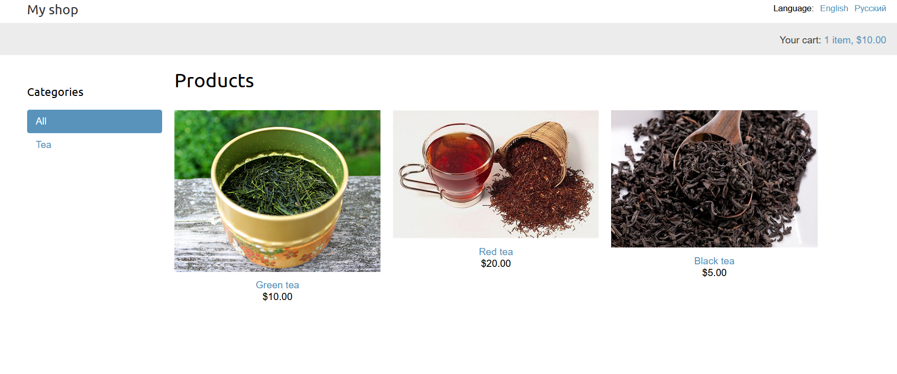

# Online Shop

   

Online shop with categories, recommendations and coupons.

## Description

Shop allows to:

- view detailed item page
- add items to shopping cart
- apply coupons
- recommend items on checkout page and detailed item page
- pay via secure Braintree API
- switch to Russian or English
- generate order details report as CSV or PDF

## Requirements

- python3.8+
- pip
- virtualenv
- Django3.1+
- Redis
- Celery
- RabbitMQ
- Braintree

### Virtual environment

Please pay attention that env variables should be places at the end of file `venv/bin/activate` (Linux) or `venv/Scripts/activate` (Windows) for security reasons. Also, they should be unset in function `deactivate`

#### activate
```bash

deactivate() {
    ...

    unset SECRET_KEY
    unset BRAINTREE_MERCHANT_ID
    unset BRAINTREE_PUBLIC_KEY
    unset BRAINTREE_PRIVATE_KEY
}

...
export SECRET_KEY="key"
export BRAINTREE_MERCHANT_ID="id"
export BRAINTREE_PUBLIC_KEY="secret"
export BRAINTREE_PRIVATE_KEY="key"
```


### Redis server

Install Redis on [Linux](https://redis.io/download) or [Windows](https://redislabs.com/blog/redis-on-windows-10/) and run server in separate terminal


### RabbitMQ on Windows

Windows has issues with tunneling RabbitMQ server running on WSL and host system.
Execute the following code in WSL:

```bash
sudo nano /etc/rabbitmq/rabbitmq-env.conf 
```

uncomment NODE_IP_ADDRESS=127.0.0.1 and save conf file

```bash
sudo service rabbitmq-server restart
```

### Celery on Windows

Additional package `gevent` is required in order to run Celery4 on Windows.
Execute the following code to run Celery:

```bash
pip install gevent
celery -A myshop worker -l info -P gevent
```

### WeasyPrint on Windows

WeasyPrint requires GTK3 installation. Use [this](https://weasyprint.readthedocs.io/en/stable/install.html#gtk64installer) to install WeasyPrint and its dependencies.


### Translation

Translation requires gettext, use [this](https://mlocati.github.io/articles/gettext-iconv-windows.html) instruction to install it

## Example

